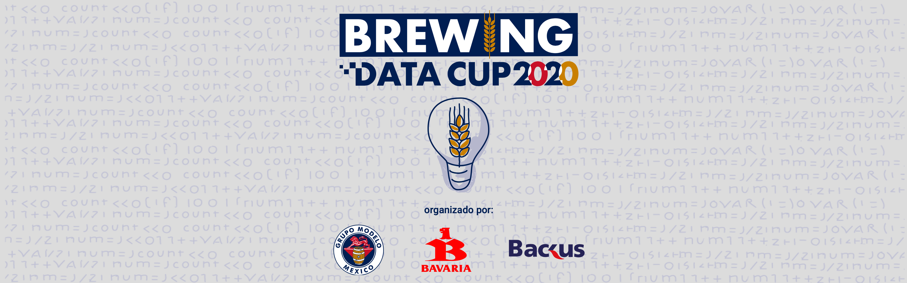

# Brewing Data Cup 2020
**Equipo**: OrozCuspi Data_MX  
**Autores**: [Felipe Orozco](https://github.com/felipeoh) y [Victor Cuspinera](https://github.com/vcuspinera)  

## Introducción

En 2020 las tres más grandes cervecerías de Latinoamerica - Grupo Modelo en México, Bavaria en Colombia y Backus en Perú - con la coordinación de AB InBev han organizado un Hackathon de Ciencia de Datos, Brewing Data Cup, para buscar soluciones innovadoras a problemas reales de negocio en función del país de los participantes.

## Problema

El reto para los participantes en **México** es de **logística**, con el objetivo de dividir un centro de distribución en seis territorios de reparto a través de un modelo de optimización que busque minimizar la distancia recorrida, con diversas restricciones: balancear los territorios por volumen sin exceder la capacidad de reparto por día, los territorios deben estar en función de la frecuencia de visita al cliente, y territorios balanceados con exactamente el mismo número de clientes.

[Ingresa aquí a la página oficial](https://www.brewingdatacup.com) para ver más detalle sobre el *Brewing Data Cup 2020*.

## ¿Qué enviar?

1. El output requerido completo.csv​

> [Los resultados se encuentran en este link](https://github.com/vcuspinera/brewing-datacup_OrozCuspi/blob/main/data/results.csv)

2. Código completo de la construcción de la solución (únicamente R o Python – no evaluaremos códigos en software comerciales).link de github​

> El [análisis exploratorio de datos (EDA)](https://github.com/vcuspinera/brewing-datacup_OrozCuspi/blob/main/src/EDA.ipynb) se desarrolló en **Python**, y el [Análisis](https://github.com/vcuspinera/brewing-datacup_OrozCuspi/blob/main/src/Analisis.pdf) en **R**. 

3. Una presentación a detalle de la metodología usada para resolver el problema, el modelo aplicado,  consideraciones y resultados obtenidos. (Máximo 5 diapositivas).​

> La presentación se encuentra en [este link](https://github.com/vcuspinera/brewing-datacup_OrozCuspi/blob/main/doc/Brewing%20Data%20Cup%202020%20OrozCuspi%20Data_MX.pptx).

